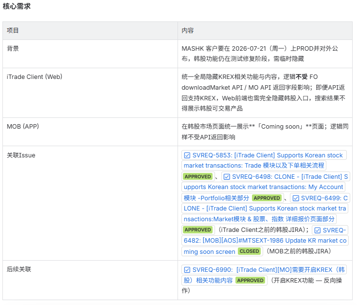
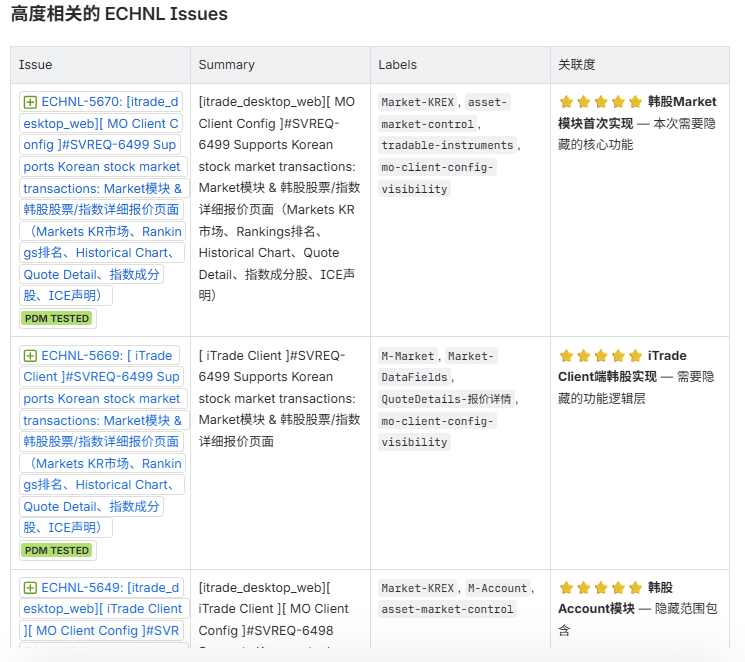
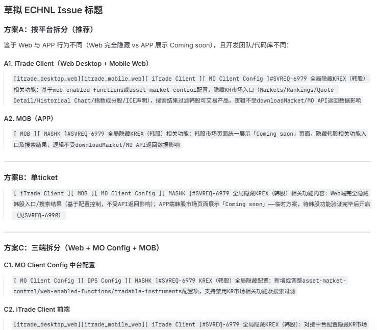
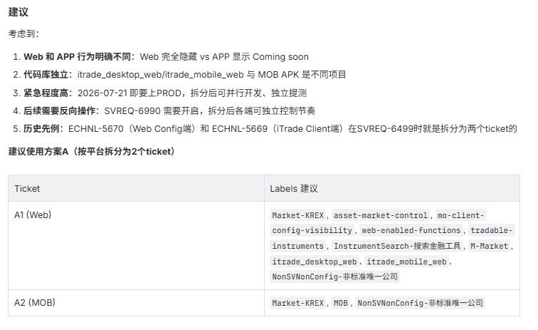

### 需求及文档
请以plan mode，把JiraReviewer工具，整合到CodeReviewer系统：把工具资源整合到CodeReviewer目录下面jira-reviewer;
以下是有个JiraReview的相关文档：
- D:\TTL\vibe-coding\JiraReviewer\docs\JiraReviewer User Manual.md
- D:\TTL\vibe-coding\JiraReviewer\docs\JiraReviewer PRD.md
- D:\TTL\vibe-coding\JiraReviewer\docs\Jira Reviewer release notes.md
- D:\TTL\vibe-coding\JiraReviewer\docs\README-v1.2.md

### 输出示例
| SVREQ |需求 | 高度相关的ECHNL issues | 草拟ECHNL issue标题 | 建议
|---|---|---|---|---
|SVREQ-6979|||||

### 其他
- 注意：完成所有开发、测试、验收工作之后，才push到https://github.com/jay-researcher/CodeReviewer分支：feature/JiraReviewer Integration