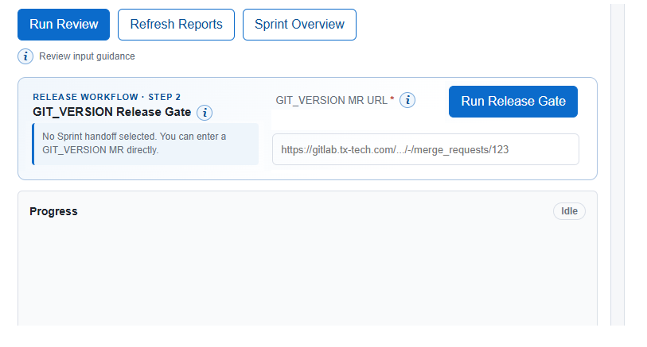
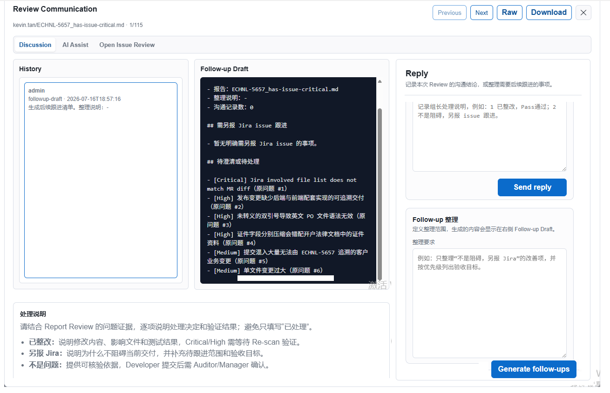

### 20260714

#### 创建分支：20260714
#### 功能清单：
请先以plan模式运行，提供完整的计划给我Review，后续再跟进开发工作；

1. 完善：按角色访问功能，并创建第一批试用developer角色的账户：gerhard.guo，bryan.tan，vincentgr.wang，kelvinh.wu；
2. 完善：基于code review report中的问题列表（目前主要关注High及Critical级别的issues），支持“处理 -> re-scan -> 问题列表 -> 处理”工作流；当问题列表的issues，都被处理（3种处理方式）完了之后（目前的要求是High及Critical级别的issues，支持修改配置），支持手动Pass（组长）；
3. 支持Issues Review History，可以查看Review历史记录；每一条记录显示的是ECHNL Issue及相关的状态信息，如： 不同处理方式的问题数量，最后更新时间，创建时间等等；
4. Report Preview：支持“Discuss”功能；
5. Review Communication > Hanlding：当选择Result字段的“不是阻碍，另报Jira"，提供表单输入：Issue Summay，Issue Description；其中Issue Description完全基于Jira ADF组件实现，也提供编辑和预览模式；提交表单之后，显示在“待创建”Tab，展示列表数据；点击行，可以编辑和查看；
6. 实际应用场景中，一般有3类人员使用 CodeReviewer：
   - Auditor：审核团队成员提交的代码、配置文件；一般是小组 Leader，可以 Review issue（单个 issues），并在线预览报告，和 AI 聊天了解报告反馈的问题，可给出处理结果，询问 AI 还有哪些 issue 需处理；如果 issues 都整改好了，可以手动操作 Pass 通过。
   - Developer：查看代码审核报告中的问题列表，查看问题清单及修复意见，做出处理，并按照处理模版，给出每个问题的处理结果。
   - Manager：在合并构建代码仓库发起的 Company_Config/GIT_VERSION/SCR 类型的分支时，先 Review 整个 Sprint 的 issues，并扫描报告，是否包括 High 及以上级别的 issues，如有发给 Auditor 跟进；确保所有的 issues 报告的问题，都已经给出处理结果，对于需要在发版本前修复的 issues，必须完成整改，并 re-scan Sprint issues。
   - Auditor、Manager：支持扫描还没有生成 Review 报告的 issues，可以统计哪些 issues 还在生成报告，哪些 issues 已经生成报告文档；哪些 issues 已经 Review Pass 通过，哪些 issues 还有问题清单在处理；注：Auditor 是以 responsible 作为判断依据。
   - 并按照下面的格式设计权限方案：

     | 功能 | Developer | Leader | Remarks |
     | --- | --- | --- | --- |
     | Run Review | - | Yes | Run Review is not visible for Developer role |

7. 以上的调整，都是基于你作为专业前端开发工程师、资深设计师的审美、设计造诣，结合自洽性，完善 web 功能设计；

需要您确认：这四名 Developer 分别对应哪些 responsible。如果暂时没有映射，建议初始按用户名自身映射，只显示明确分配给他们的 Issue。
<- 按照以下的关系映射：
wen.yin <-> gerhard.guo , bryan.tan
kevin.tan <-> vincentgr.wang , kelvinh.wu

第一阶段支持常用 ADF 节点：
<- 补充Expand节点；

本期仅覆盖“待创建 Jira 草稿”。真正调用 Jira API 创建 Issue 建议作为独立开关，等项目、Issue Type、权限及字段映射确认后启用。
<- 后续整合JiraReviewer由Manager角色创建真的Jira issue。

#### 需要您 Review 的关键决策
建议按以下默认方案执行：
1. Leader = Auditor，不增加第四种角色。
<- Ok
2. Critical/High 的“已整改”必须经过后续 Re-scan 验证。
<- Ok
3. “不是阻碍，另报 Jira”默认不能解除 Critical/High 阻碍。
<- Manager角色可以手动解除；
4. Developer 提交“不是问题”后，必须由 Auditor/Manager 确认。
<- Ok
5. Jira ADF 使用 Atlaskit React/Vite 组件进行技术验证。
<- Ok；后续会使用Flutter框架+Dart编程语言；
6. 本期做到 Jira “待创建”草稿，不自动调用 Jira 创建。
<- Ok.后续整合JiraReviewer由Manager角色创建真的Jira issue。
7. 使用 SQLite 保存新工作流和审计数据，兼容迁移现有 JSON 数据。
<- Ok.后续使用MongoFB数据库或其他特定用途的专用数据库。
8. 四名 Developer 的 responsible 映射需要在开发前确认。
<- 按照以下的关系映射：
wen.yin <-> gerhard.guo , bryan.tan
kevin.tan <-> vincentgr.wang , kelvinh.wu
9. 补充：第一阶段支持常用 ADF 节点：
<- 补充Expand节点；

#### 开发完成之后，更新CodeReviewer User Mannual.md；

### 20260721
#### 1、创建分支：20260721
#### 2、功能清单：
1. 调整：使用RAG系统，代替现有fetch_jira.py，以及拉取下来的数据文件；

3、开发完成之后，更新CodeReviewer User Mannual.md；

### 2026-07-16：
#### JiraReviewer
- Improvement类型，使用了bug类型的模版；
#### Code Reviewer：
- 预期前后端处理同一个issue，出具报告时，应该是按照config.yml，type=frontend | backend，分离问题清单的；
- 在做release gate , final sprint review时，使用 python review.py --mr-url <GIT_VERSION MR> ;
- 如果Jira issue交付了之后，再发现有问题，我们会更新issue状态为Backlog，添加到新的Sprint（之前Complete的Sprint也同时存在），issue workflow：Backlog -> Open -> In Progress -> Development Done -> Dev Change Reviewed ；同时，按照issue description的模版，在issu comment说明继续修复的问题；当状态再次更新到Development Done之后，由于之前的代码已经合并到目标分支，当issue需要再处理时，会发送新的MRs，这时通过CodeReview出具报告文档，预期是diff的内容只是第二次调整的代码，但会结合目标分支最新的代码评估这次的变更有什么影响，预期LLM prompt应该只是这次的增量；
- Discuss > Discussion,Handling 和 Issue Review History右边面板的Problems ，在功能设计是否有重叠？该如何编排才能更好实现线上预览报告、处理、Auditor Review、Pass 闭环？
- 基于已有D:\TTL\vibe-coding\CodeReviewer\7.x-docs\CodeReviewer-7.0-Issue-Workflow.md 完善Issue Review Workflow，评估和测试流程是否闭环了？如没有，请继续完成自洽性测试和开发，并完成验收；
- public release notes.md：包含每次调整的概括性总结，可以在站点点击查看release notes；

### 2026-07-17：

#### CodeReviewer
- 1、Company_Config、SCR：输出报告标题，调整为：<Rroject>-<Company Config|SCR>_has-issue-<level>.md；新增Responsible kelvinh.wu，组员：benyq.feng； Luckxh.chen作为DPS Config以及MO Client Config的Responsible；
- 2、Run Review设计改善：
- 3、Review Communication页面布局优化：
- 4、GIT_VERSION：需要按照config.yml定义的gitlab projects划分，如 WVAdmin、iTrade Client、Services Terminal、DPS都有自己的GIT_VERSION分支和MR；
- 5、Pending Jira：考虑接入Jira原生自带的组件，而不是自己开发；

#### JiraReviewer
注：Codex已经给出了建议方案；
- SM备注说明：在表格上面，新增段落：核心需求（或需求概要）、高度相关的ECHNL issues（table格式：Issue，Summary，Labels，关联度）、SVREQ-xxxx Description 错别字/问题检查、关键发现（如有的话）；
- 接入Jira Rovo，而不优先使用LLM，创建Jira issue；
