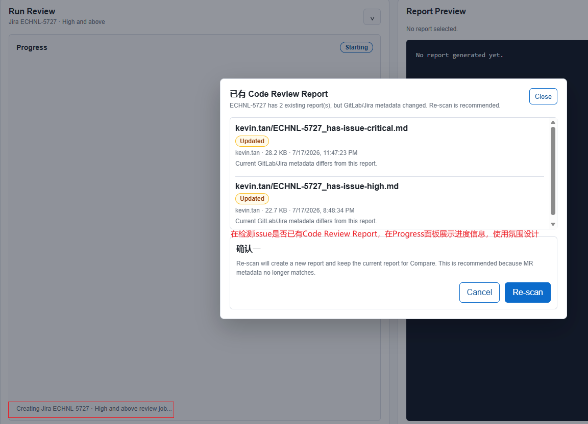
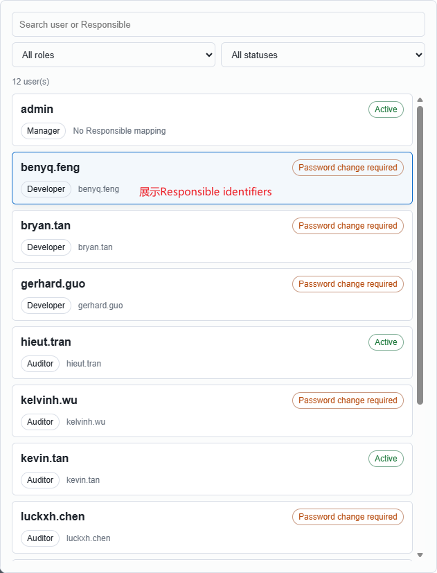
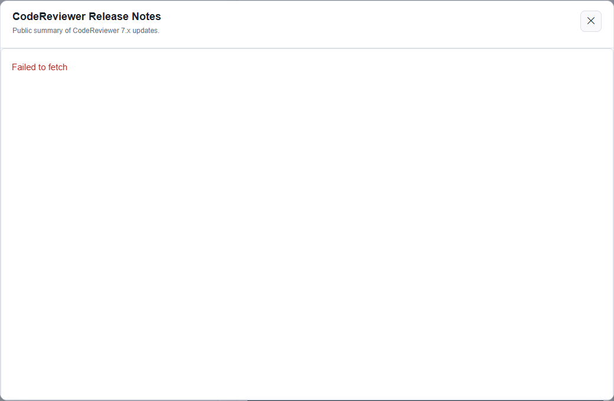
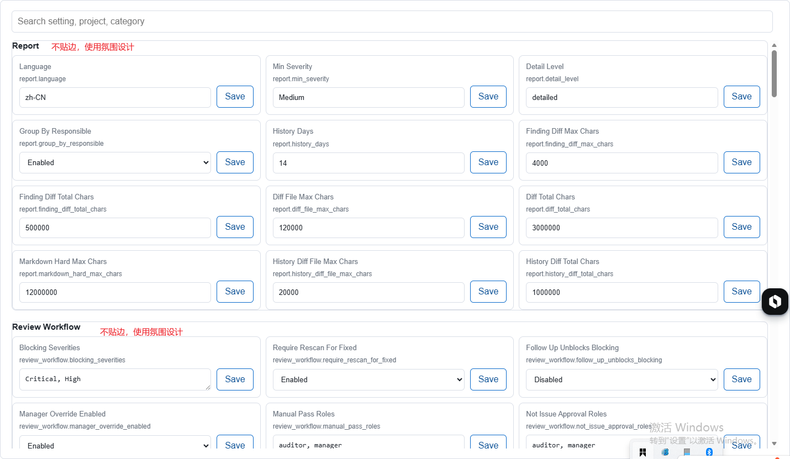
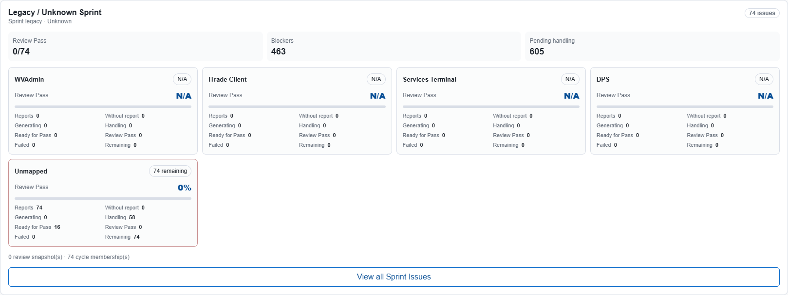
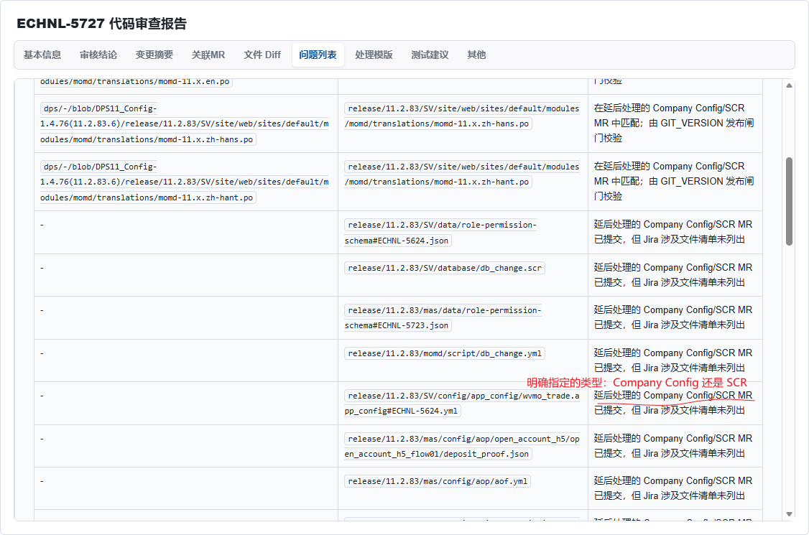
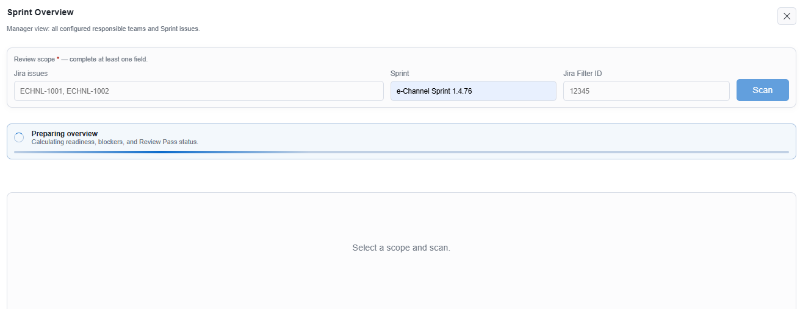

- config.yml: branch节点，支持配置通配符，表示，取最大版本号的分支作为合并的目标分支；也保留设定指定版本号的方式；
    - iTrade Client: 7.5.0.* , 7.5.1.*
    - DPS: 9.3.* , 11.2.*
    - WVAdmin: 1.0.*
    - Services Terminal: 5.0.*
- 支持接入Rovo；不再考虑搭建RAG系统，也不再使用D:\TTL\jira-prd 中沉淀的需求资料；
    - Jira REST API token：创建 ECHNL、更新字段、建立 Blocks/Relates。你现有 JIRA_TOKEN 已具备这条能力。
    - Rovo：用于检索相关 Jira/Confluence/Teamwork Graph 信息，辅助发现历史 Issue、关联实现和上下文。
    - JiraReviewer：继续负责字段映射、语义规则、标题、ADF Description、duplicate guard 和 audit check。
- Run Review：检测issue是否已有Code Review Report的氛围设计；
- User Management：
- Release Notes:failed to fetch 
- Configuration: 强化氛围设计，文字不贴边；
- Issues Review History：View all Sprint Issues，修改为 View sprint issues，并不用独占一行，满足氛围设计要求；
- Report Review > Problems：明确文件是在哪个特殊MR类型提交的，如 “Company Config”or “SCR”；
- Report Review > Problems：除了列出标题，还需要把“问题”和“建议”以最多2行的摘要展示，点击“更多”可以展示完整的内容，满足氛围设计要求；
- Review Communication > Reply：调整布局的合理性，满足合理、自洽性；
- Report Review：调整所有Tab页面（如 基本信息，审核结论，处理模版，其他等）字体大小，间距；
- Sprint Review：当超过指定时间，如30s之后，需要开始超时倒计时，给用户更好的氛围设计体验；