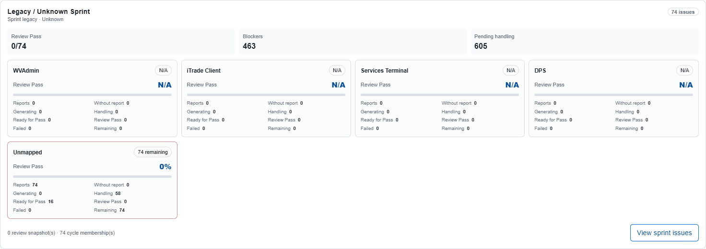
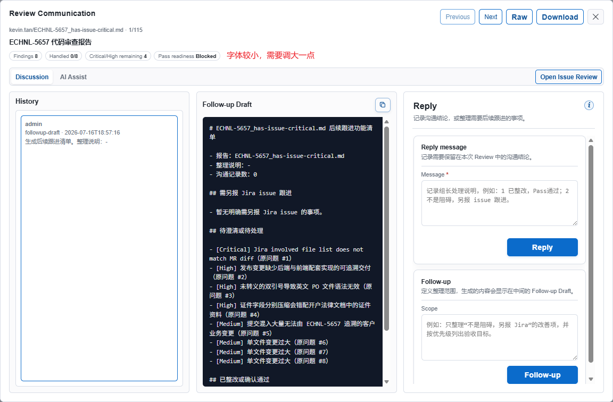
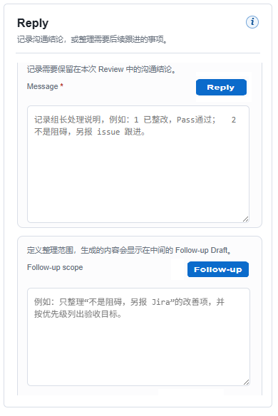
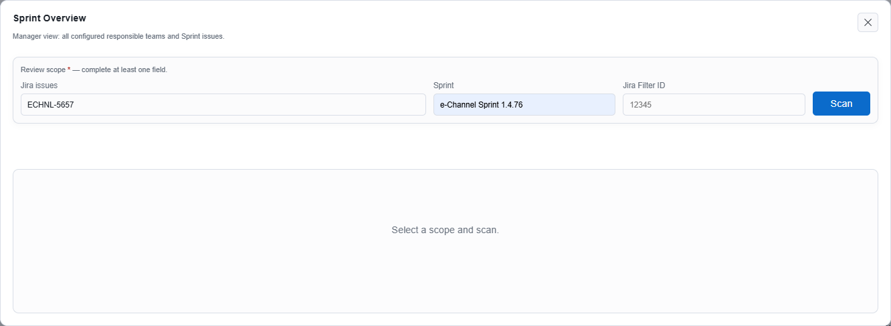
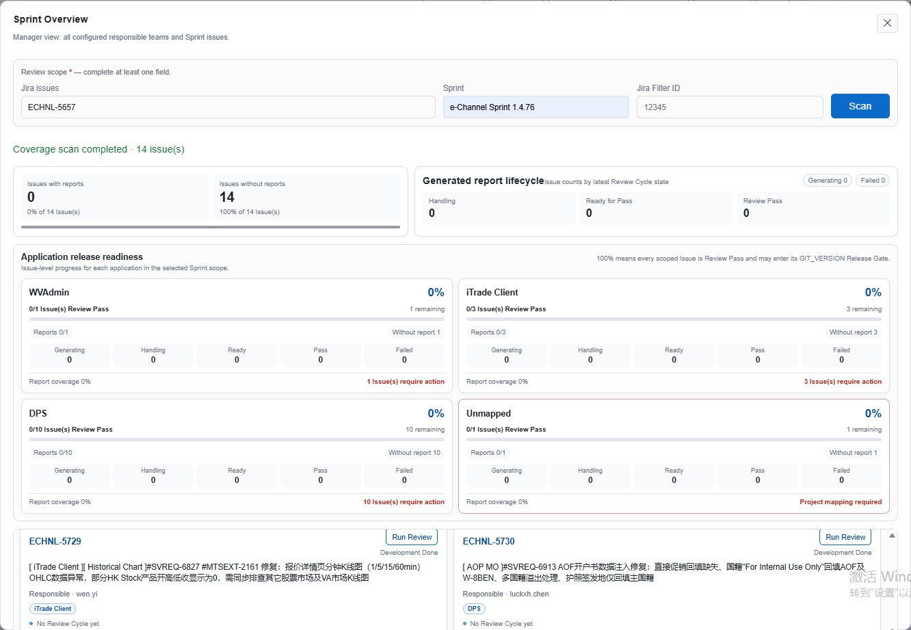
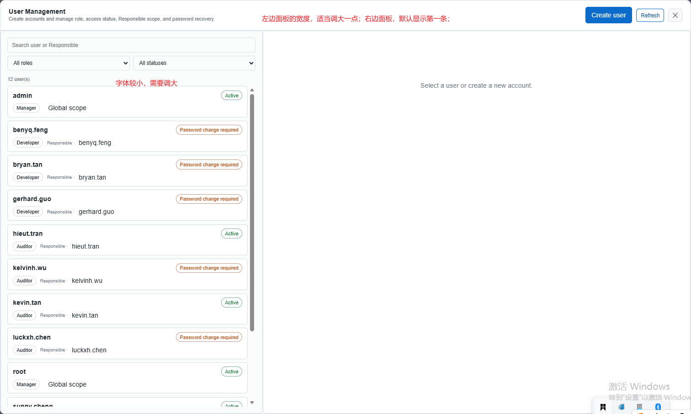

- Issues Review History > Overview：卡片字体过小，需要对齐其他页面设计规范；一行显示3个卡片
- Review Communication: 调大窗口的显示规格；
- Review Communication > Reply：调整布局的合理性，满足合理、自洽性；
- Sprint Review：点击“Sprint Review”按钮显示弹窗，不用回填“Jira Issues”输入框字段；
- Sprint Review：页面设计太拥挤了，结合氛围设计，使用Tab页重新编排一下，可考虑使用：Overview ，Sprint issues；
- User Management: 如图所示，结合氛围设计进行调整
- 前端设计规范：结合氛围设计，定义弹窗常用的几种规格，按照定义的规格展示弹窗；
- Issue Review History > Problems：除了列出标题，还需要把“问题”和“建议”以最多2行的摘要展示，点击“更多”可以展示完整的内容，满足氛围设计要求；
- Configuration > Applicaiton settings: 字眼Llm，修改为 LLM