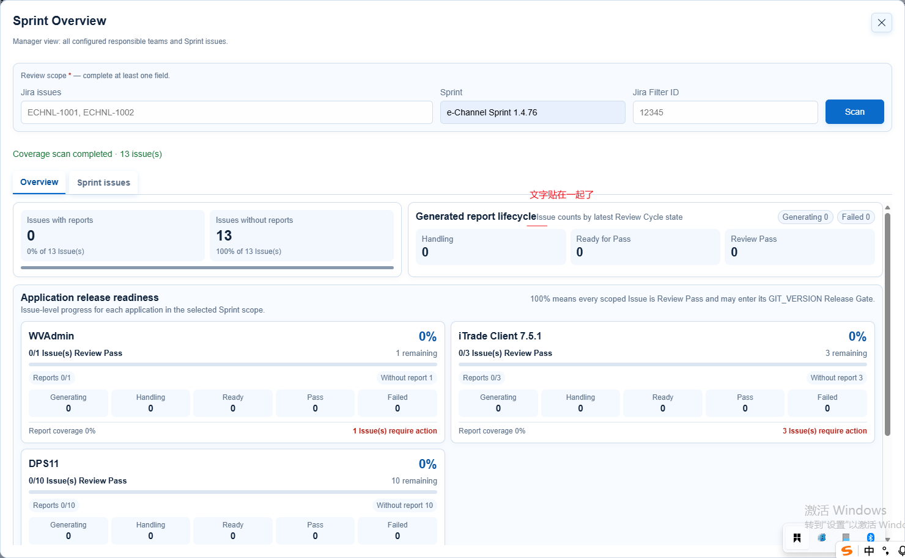
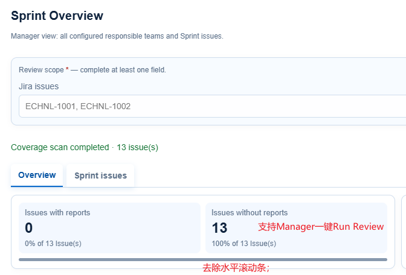
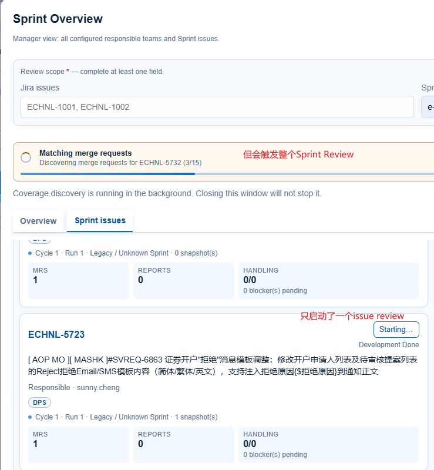
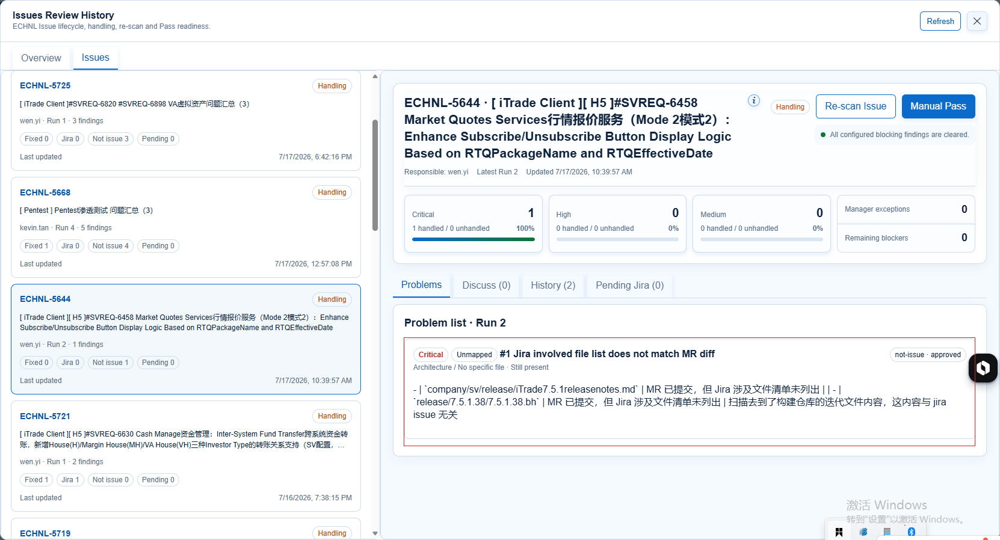
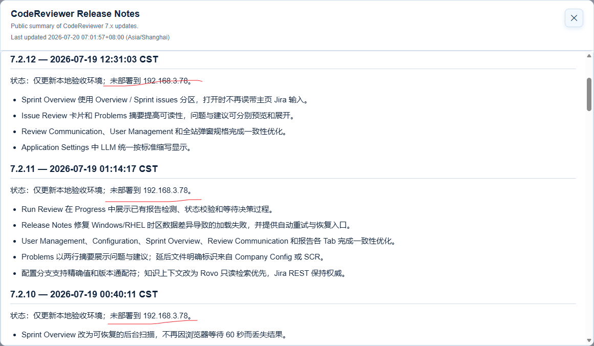

- Sprint Review > Sprint Overview: 文字贴边了；
- Sprint Review > Sprint Overview: 
- Sprint Review > Sprint issues：只启动了一个issue Review，但会触发整个Sprint Review;
- Report Review > Problems：除了列出标题，还需要把“问题详情”和“处理建议”以最多2行的摘要展示，点击“更多”可以展示完整的内容，满足氛围设计要求；
- 请基于TTL（公司简称） x Jay（CodeReviewer创始人），生成一个具有结晶含义的logo，并应用于网站；
- Release notes：7.2.13版本之前的说明没有更新部署状态 
- 由于issue 的配置或数据库更新，都是deferred to Company Config/ SCR MR类型的分支；目前每个issues会修改哪些配置文件，或数据库，没有明确说明，所以考虑从issue report的Problems列表“[Critical] Jira involved file list does not match MR diff”table列表中移除；
