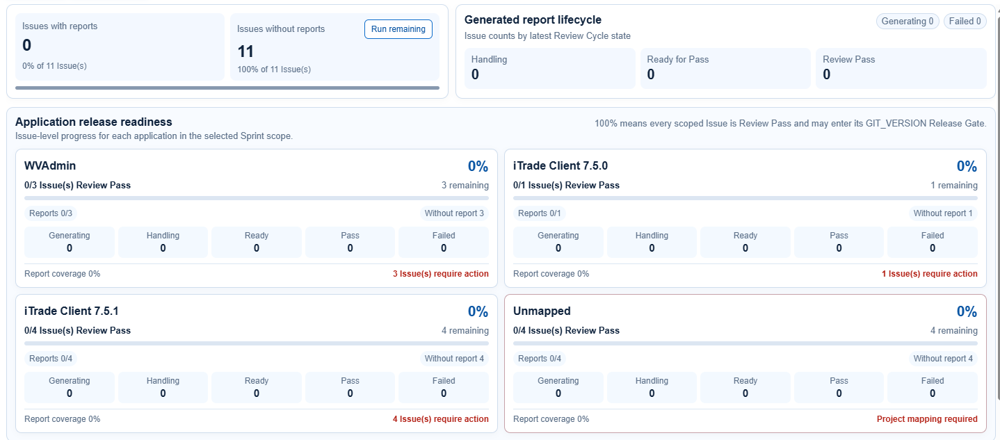
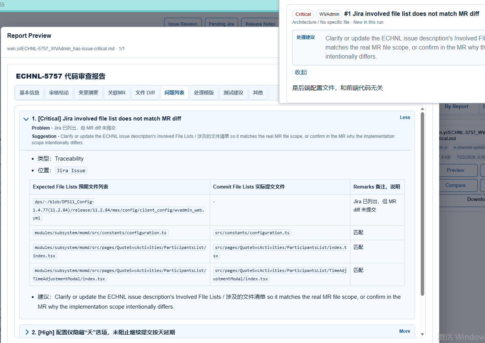
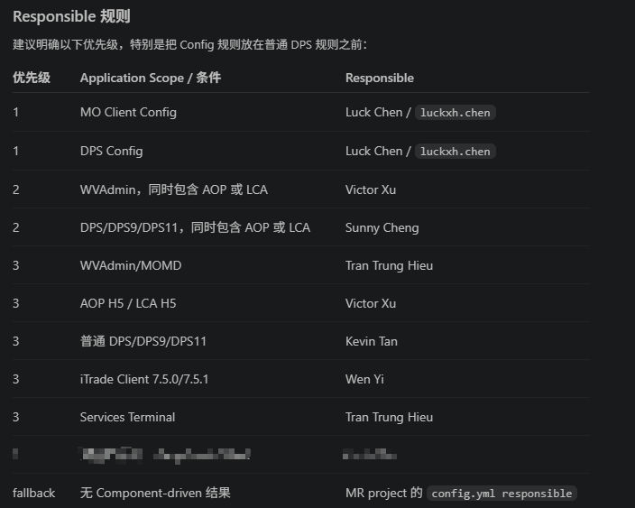

# CodeReviewer v7.2.14 Web 功能设计

更新时间：2026-07-22
状态：v7.2.15 本机实现与验收基线（未部署到 192.168.3.78）

## 1. 反馈问题

1. Issues Review History > Overview：e-Channel Sprint 1.4.77 的 `without report` 统计不准确。

   

2. Issues Review History > Issues：右侧详情面板新增 Jira Issue 链接，点击后在新 Tab 打开 Issue 详情。

3. Issues Review History > Issues > Problems：问题详情与 Report Review 的 Problem 详情保持一致，展示完整、具体的问题证据。

   

4. Responsible 使用 Component-driven 规则；没有规则命中时才按实际 MR project 的 `config.yml responsible` fallback。

   

## 2. 设计目标

- 让用户一眼分清“唯一 Jira Issue”“应用审核单元”和“生成的报告”，避免将不同口径相加比较。
- Overview 与 Issues 使用同一份 Review Cycle 数据和相同状态定义，刷新后结果一致。
- 同一个 Jira Issue 可以对应多个应用或版本，每个应用/版本独立计算报告覆盖和 Release Readiness。
- Responsible 表示交付归属；Reviewer permission 表示审核权限，两者互不污染。
- Responsible 的每次判定都能解释命中了什么证据、使用了哪条规则、是否发生 fallback。
- Problems 在 Report Review 和 Issues Review History 中复用同一视觉组件、字段模型和交互行为。

## 3. 统一概念与统计主键

### 3.1 三个不可混用的计数

| 名称 | 定义 | 示例 |
| --- | --- | --- |
| Unique Issues | 当前 Sprint / Review Cycle 内去重后的 Jira Issue 数 | ECHNL-5761 只计算 1 个 Issue |
| Application Review Scopes | 一个 Issue 在一个 Application + Release Line 下的审核单元 | ECHNL-5761 同属 iTrade 7.5.0 和 7.5.1，计算 2 个 Scope |
| Reports | 已生成并归属于某个 Application Review Scope 的最新有效报告 | 两个 Scope 均完成审核时应有 2 份逻辑报告 |

Application Review Scope 的稳定主键为：

```text
Review Cycle + Jira Issue + Application + Release Line
```

Responsible 不参与主键。即使两个 Scope 都由 Wen Yi 负责，也不能因此合并成一份逻辑报告。

### 3.2 Scope 证据来源

应用范围按以下顺序解析：

1. Jira Component：主要驱动来源。
2. Description 中“涉及的文件清单”：补充缺失范围并校验 Component。
3. Description 其他内容：仅允许明确应用名、配置类型或可识别路径触发，禁止使用宽泛词语猜测。
4. MR project：前三项无有效驱动结果时，用于 application/responsible fallback。

多个来源命中时取 Scope 并集；同一 Scope 的重复证据去重。已有明确 Component Scope 时，文件清单默认只作为佐证，不因同义配置路径重复增加报告；只有文件明确指向另一个独立应用且不存在对应 Component 时，才新增候选 Scope，并在界面标记 `Derived from file list` 供用户核验。

MOMD、AOP、LCA 等业务模块不是天然独立的可发布应用线，应附着到 WVAdmin、DPS9、DPS11 等实际 Application Scope。

## 4. Issues Review History > Overview

### 4.1 页面信息架构

页面按以下顺序展示：

1. Scope bar：Sprint、Review Cycle、Last refreshed、Refresh。
2. Coverage summary：Unique Issues 与 Application Review Scopes。
3. Generated report lifecycle：报告生成和处理状态。
4. Application release readiness：按 Application + Release Line 展示审核单元。

首屏摘要建议明确显示：

```text
11 unique Issues · 12 application scopes
```

当应用卡片 Issue scope 数之和大于 Unique Issues 时，在数字旁提供说明 Tooltip：

> One Jira Issue may belong to more than one application or release line. Application cards count review scopes; the summary counts unique Jira Issues.

### 4.2 Coverage summary 口径

摘要卡片使用 Unique Issue 口径：

- `Issues fully covered`：该 Issue 的所有 required scopes 都存在最新有效报告。
- `Issues partially covered`：至少一个 required scope 有报告，但仍有 scope 缺报告。
- `Issues without reports`：所有 required scopes 均无报告。
- `Unmapped Issues`：无法形成任何有效 Application Scope。

摘要必须满足：

```text
fully covered + partially covered + without reports + unmapped = unique Issues
```

不再使用“任意一份报告即 Issues with reports”的模糊口径。

### 4.3 Application 卡片口径

每张卡片只统计当前 Application + Release Line 的 Review Scope：

- Scope 总数
- Reports / Without report
- Generating
- Handling
- Ready for Pass
- Review Pass
- Failed
- Remaining
- Report coverage
- Release readiness

计算公式：

```text
Report coverage = 最新有效报告 Scope 数 / Required Scope 总数
Release readiness = Review Pass Scope 数 / Required Scope 总数
Remaining = Required Scope 总数 - Review Pass Scope 数
```

状态互斥，按当前 Review Cycle 中每个 Scope 的最新逻辑 Run 归类。旧 Cycle、旧 Run、其他 Application/Release Line 的报告不得参与。

### 4.4 卡片视觉与交互

- 桌面宽屏一行 3 张卡片；中等宽度 2 张；窄屏 1 张。
- 卡片标题为 Application，版本号作为同级标题内容，例如 `iTrade Client 7.5.1`，不得仅靠 Tooltip 区分。
- 百分比使用 24px/600，主要计数使用 18px/600，辅助说明不小于 13px。
- 颜色不是唯一状态线索；状态同时显示图标、名称和数字。
- `Unmapped` 使用警示边框，但避免整卡高饱和红色。显示明确动作 `Resolve mapping`。
- 点击 Reports、Without report、Handling、Failed 或 Remaining 可进入 Issues Tab，并自动带入对应过滤条件。
- `Run remaining` 只处理当前筛选范围内缺报告且已映射的 Scopes；Unmapped 不进入队列。
- 执行前显示确认摘要：将运行多少个 Unique Issues、多少个 Scopes、跳过多少个 Unmapped。
- 运行期间按钮显示进度且防重复提交；完成后刷新当前 Cycle，不重置用户筛选。

### 4.5 空状态与异常状态

- 无 Sprint：提示先选择 Sprint，不展示全为 0 的误导性卡片。
- Sprint 无 Issue：展示 `No Issues in this Sprint`。
- 有 Issue、无 Scope：进入 Unmapped，并展示未识别的 Component/证据。
- Scope 有报告但报告已过期：显示 `Stale report`，计入 Remaining，不计入有效 Reports。
- 数据接口部分失败：保留可用数据，在对应区域展示 `Last successful refresh` 和重试入口，不把失败误报为 0。

## 5. Issues Review History > Issues

### 5.1 Master-detail 布局

- 左侧 Issue 列表，右侧详情面板；桌面建议比例为 38% / 62%，右侧最小宽度 680px。
- 窄屏改为列表与详情单页切换，提供清晰的 Back to Issues。
- 左侧卡片展示 Jira key、Summary、Scope chips、Responsible、状态、最新 Run、findings 数和更新时间。
- 搜索支持 Jira key、Summary、Application、Release Line、Responsible 和 Reviewer domain。
- 过滤器与 Overview 下钻条件保持同步，并以可移除 Filter chips 显示。

### 5.2 Jira Issue 链接

右侧标题使用以下结构：

```text
ECHNL-5757 ↗  Summary
```

- Jira key 是真实链接，使用 `target="_blank"` 与 `rel="noopener noreferrer"`。
- 外链图标及可访问名称明确提示 `Open ECHNL-5757 in Jira (new tab)`。
- 链接 URL 由 Jira base URL + 已校验的 Issue key 生成，不直接信任任意外部 URL。
- 无 Jira base URL 时显示不可点击 key，并提供 `Jira link unavailable` Tooltip。

### 5.3 Issue Overview 元数据

详情头部展示：

- Current status
- Application / Release Line scopes
- Delivery Responsible
- Review domain / Authorized reviewer
- Latest logical Run
- Last updated
- Report coverage
- Release readiness

Responsible 展示为交付负责人，不把 Wen Yi 等上级 Reviewer 混入该字段。

## 6. Problems 统一组件

Issues Review History 和 Report Review 必须调用同一个 `ProblemDetail` 组件及同一规范化 Finding ViewModel，禁止维护两套 HTML 拼装逻辑。

### 6.1 收起状态

默认展示：

- Severity
- Application Scope
- Finding 编号与标题
- Problem 摘要，最多 2 行
- Suggestion 摘要，最多 2 行
- Handling 状态与审批状态
- `More` / `Less`

Critical/High 默认展开第一个未处理问题；其余默认收起。用户展开状态在当前 Issue 会话内保留。

### 6.2 展开状态

按实际存在的数据依次展示：

1. Problem：具体问题、触发条件和影响。
2. Evidence：文件、行号、MR、Jira description 或配置证据。
3. Suggestion：可执行的处理建议。
4. Type、Location、Application Scope、Related MR。
5. Expected vs Actual / File list comparison 等结构化表格。
6. Handling、Discussion、approval history。

不要仅显示标题和 Suggestion。Markdown、表格、代码、路径链接及换行行为必须与 Report Review 一致。

### 6.3 文件与 MR 链接

- 文件证据优先显示 `project!MR/path:line`，避免多个 MR 中同名路径无法区分。
- 点击文件在新 Tab 打开对应 GitLab ref；无可靠 ref 时只显示文本，不生成失效链接。
- 特殊 MR 类型显示清晰标签，例如 `Company Config`、`SCR`、`GIT_VERSION`。
- 宽表格在组件内部横向滚动，页面本身不产生横向滚动；表头在长内容滚动时保持可见。

### 6.4 操作权限

- Developer：提交 Handling/Reply，查看自己可访问 Scope。
- Delivery Responsible/Auditor：处理归属范围内的问题。
- Authorized Reviewer：可 Review、判定 Not Issue、批准处理、Re-scan、Review Pass。
- Manager：全局权限及审计覆盖。

所有写操作显示 actor、时间、原状态与新状态；无权限时隐藏操作按钮，但保留只读状态说明。

## 7. Responsible 与 Reviewer 权限模型

### 7.1 Responsible 解析规则

Jira Issue field `Responsible` 不参与 Responsible scope 推断。它可以作为 JiraReviewer 的最终写入字段或历史展示字段，但不能反向驱动 Application Scope 或 owner。

规则优先级如下：

| 优先级 | Application Scope / 条件 | Delivery Responsible |
| --- | --- | --- |
| 1 | MO Client Config | Luck Chen / `luckxh.chen` |
| 1 | DPS Config | Luck Chen / `luckxh.chen` |
| 2 | WVAdmin，同时包含 AOP 或 LCA | Victor Xu |
| 2 | DPS/DPS9/DPS11，同时包含 AOP 或 LCA | Sunny Cheng |
| 3 | 普通 WVAdmin/MOMD | Tran Trung Hieu |
| 3 | AOP H5 / LCA H5 | Victor Xu |
| 3 | 普通 DPS/DPS9/DPS11 | Kevin Tan |
| 3 | iTrade Client 7.5.0/7.5.1 | Wen Yi |
| 3 | Services Terminal | Tran Trung Hieu |
| fallback | 无 Component-driven Responsible 结果 | 实际 MR project 的 `config.yml responsible` |

不设置“其他 Component 默认 Kevin Tan”。无法命中规则时直接进入 fallback；没有 MR 或 MR project 无法匹配配置时，标记 `Unmapped / Responsible required`，不可静默分配给任何人。

### 7.2 多证据冲突

- Config 特定规则优先于普通 DPS/WVAdmin 规则。
- 同一个 Application Scope 命中多个不同 Responsible 时，不自动选择；标记 `Responsible conflict` 并列出证据。
- 一个 Issue 包含多个 Application Scope 时，每个 Scope 独立解析 Responsible。
- fallback 按每个 Scope 关联的实际 MR project 分别执行，不能取 Issue 的第一个 MR 作为全部 Scope 的 owner。

### 7.3 可解释性展示

在 Issue Scope 详情中提供只读 `Assignment rationale`：

```text
Responsible: luckxh.chen
Source: Jira Component
Evidence: MO Client Config
Rule: responsible.component.mo_client_config
Policy version: 7.2.14
```

fallback 时显示：

```text
Source: config fallback
MR project: web-sv-build/dps
Config entry: build-repository/dps
```

### 7.4 Delivery Responsible 与 Authorized Reviewer 分离

Wen Yi 是 Web 前端审核负责人，可以 Review Hieu / Victor 在 WVAdmin、Services Terminal 范围内的工作，但不应被追加到这些报告的 Delivery Responsible。

建议策略：

```yaml
review_domains:
  web_frontend:
    applications:
      - WVAdmin
      - Services Terminal
    reviewers:
      - wen.yi
```

权限按 Application Scope 判定，而不是简单配置 `wen.yi -> hieut.tran + victor.xu`。这样不会让 Wen Yi 获得 Hieu/Victor 在其他应用中的审核权限。

每个 Review Run 固化：

```json
{
  "application_scope": "WVAdmin",
  "release_line": "1.0",
  "delivery_responsible": ["victor.xu"],
  "review_domain": "web_frontend",
  "authorized_reviewers": ["wen.yi"],
  "policy_version": "7.2.14"
}
```

历史记录分别保存 `handled_by`、`reviewed_by`、`passed_by`，确保人员或策略变化后仍可解释当时权限。

## 8. JiraReviewer 与 CodeReviewer 一致性

两套系统应共用同一份可版本化 policy schema 和 resolver 测试数据：

- JiraReviewer：根据 Scope 写入目标 ECHNL 的 Responsible。
- CodeReviewer：根据相同 Scope 生成报告、计算 coverage、决定 Delivery Responsible 与审核权限。
- 两边均不得从 Jira `Responsible` field 反推 Scope。
- 两边对同一输入输出相同的 Application Scope、Release Line、Delivery Responsible、Review domain 和 rule id。
- 集成到一个平台前，使用共享 contract fixtures 做跨项目回归测试，避免复制两份条件分支后继续漂移。

## 9. 视觉规范

- 使用现有浅蓝灰设计语言；页面背景、卡片和浮层形成三级层次，不使用大面积纯白叠纯白。
- 正文 14px/1.55，辅助文字 13px，区块标题 16px/600，页面标题 20px/650。
- 卡片内边距 16px，区块间距 16–20px，控件最小高度 36px，可点击目标不小于 40×40px。
- Success、Warning、Error、Info 颜色均满足 WCAG AA 对比度，并同时搭配文本或图标。
- Modal 只用于短任务；Problems、Issue details 等长内容使用固定详情面板或大规格工作区，不再使用层层弹窗。
- Loading 使用局部 skeleton；刷新时保留现有内容，避免整个页面闪白。
- 键盘可完成 Tab 切换、问题展开、筛选清除与外链访问；焦点样式始终可见。

## 10. 验收场景

1. 11 个 Unique Issues，其中一个同时属于 iTrade 7.5.0/7.5.1：摘要显示 11 Issues、12 Scopes；两个应用卡片各计算一次，该 Issue 需要两份逻辑报告。
2. 一个 Issue 的两个 Scope 只有一个有报告：该 Issue 计入 `partially covered`，不能计入 fully covered 或 without reports。
3. ECHNL-5757 命中 MO Client Config 与 WVAdmin/MOMD：形成两个 Scope，分别归属 Luck Chen、Tran Trung Hieu；DPS Config 文件证据在已有明确 Scope 时作为校验信息，不无条件增加第三份报告。
4. WVAdmin 同时包含 AOP/LCA：Delivery Responsible 为 Victor Xu；Wen Yi 因 `web_frontend` review domain 可以审核，但不出现在 Responsible 中。
5. Services Terminal：Delivery Responsible 为 Tran Trung Hieu；Wen Yi 可以审核其 Services Terminal Scope，不能因此审核 Hieu 的非 Web Scope。
6. 未知 Component、有可匹配 MR：使用该 MR project 的 `config.yml responsible`，界面展示 fallback rationale。
7. 未知 Component、无 MR：显示 Unmapped / Responsible required；Run remaining 跳过并解释原因。
8. 同一 Scope 的 Component 与文件清单重复命中：只生成一个 Scope/报告。
9. Overview 点击 Without report 后，Issues Tab 的过滤结果数量与来源卡片一致；返回 Overview 后筛选仍保留。
10. Issues 与 Report Review 打开同一个 Finding：标题、Problem、Suggestion、证据表格、处理状态和 MR/file link 完全一致。
11. Jira link 在新 Tab 打开并包含 `noopener noreferrer`；Jira 配置缺失时不生成错误链接。
12. API 部分失败时显示上次成功数据和错误提示，不把未知状态展示为 0。

## 11. 非目标与发布边界

- 本设计不授权自动修改 Jira Responsible 历史数据。
- 本设计不授权自动部署或重启 192.168.3.78。
- 默认先在本地实现、测试和进行 UI 验收；只有收到明确指令后才部署到 3.78。
