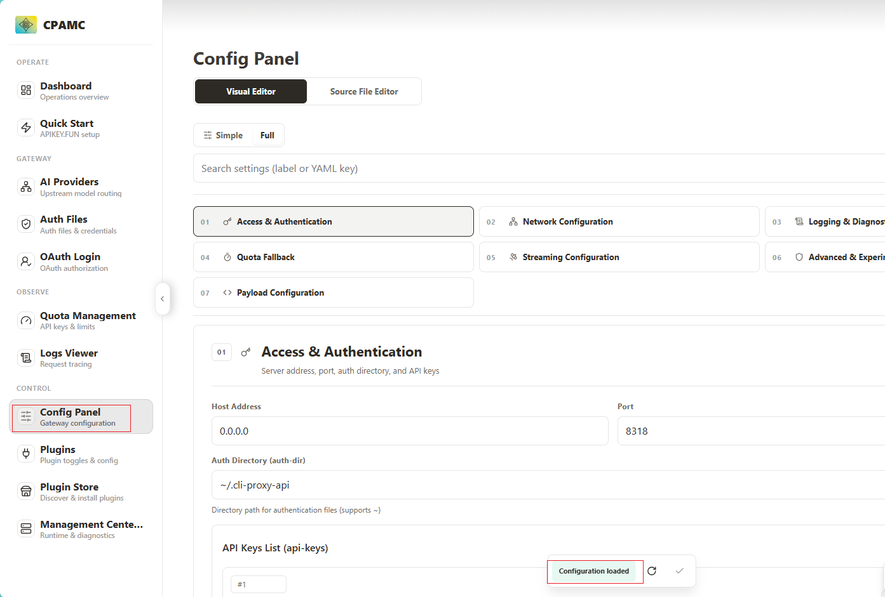
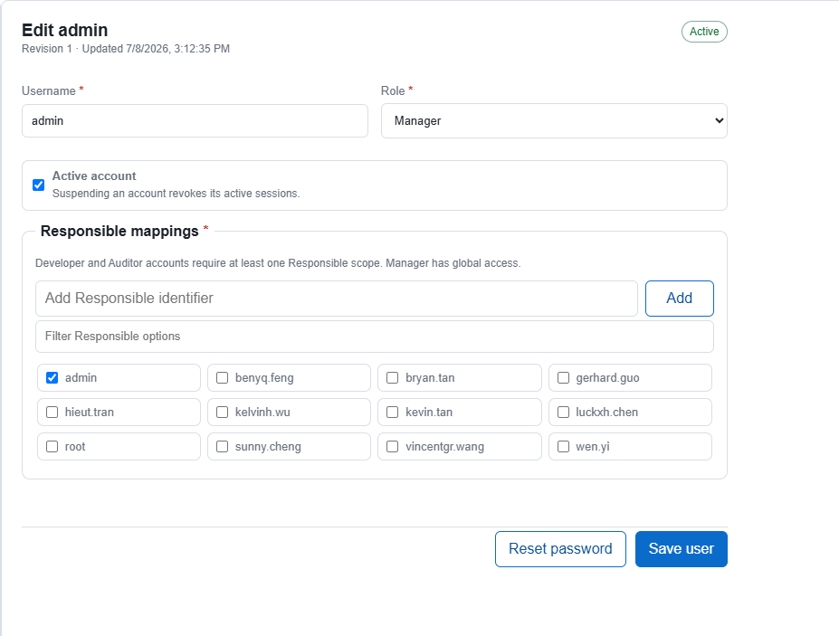
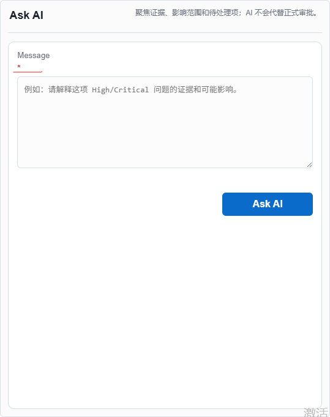
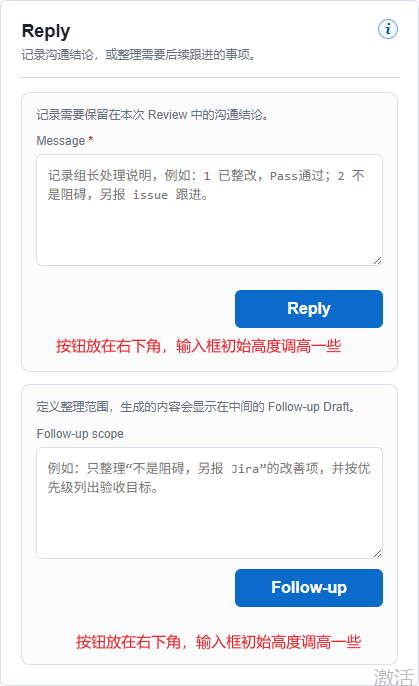
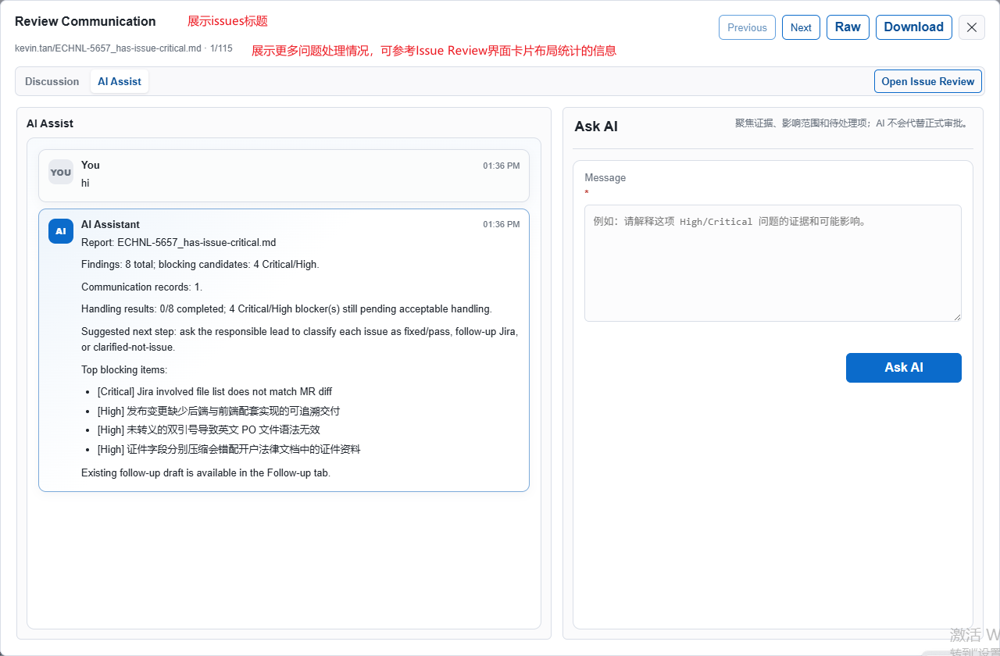
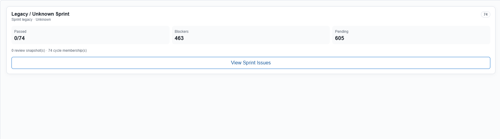

#### 2026-07-18 feedback for 7.2.8
7.2.8问题反馈：基于你作为专业前端开发工程师、资深设计师的审美、设计造诣，结合自洽性，完善 web 功能设计；
- 支持在线维护Gitlab项目，参考CLIProxyAPI（CPA)，从config.yml读取gitlab项目：DPS（DPS9、DPS11）、iTrade（7.5.0,7.5.1）、Services Terminal、WVAdmin，及其子节点配置信息；并支持在线维护；
- 支持在线维护应用配置，参考CLIProxyAPI（CPA)，从config.yml读取配置节点；并支持在线维护；
- 在登录页、主页：新增Healthy status indicator，使用氛围设计，可点击进入详情页查看；
- User Management: 左边列表页面，messy layout.
- User Management：右边面板，Responsible mappins的设计是否符合预期，并补充一下如何使用？更新到User Mannual手册；
- CodeReviewer Release Notes：显示最后更新时间 
- Change Password:必填、必须字段，使用红*表示，并放在字段的后面（保持一定间隔）；
- Review Communication > Reply：调整布局的合理性，满足合理、自洽性； 
- Report Review：调整字体大小，间距；
- 参考Sprint Review最新的实现：按 WVAdmin、iTrade Client、Services Terminal、DPS 分别展示 Release Readiness；进度计算：Review Pass Issue 数 ÷ 应用关联 Issue 总数。例如 5 个 Issue 中 4 个已 Pass，显示 80%，剩余 1 个；每个应用展示：Reports / Without report，Generating，Handling，Ready for Pass，Review Pass，Failed，Remaining Issues 

## v7.2.9 处理结果（2026-07-18）

- [x] Manager Configuration 支持 Application settings、GitLab projects、Backups & restore；采用独立 Web override、revision、原子写、备份和审计。
- [x] 登录页及主页提供可点击的健康状态；未登录信息保持脱敏。
- [x] User Management 左栏卡片和筛选重排；Responsible 明确为访问范围，Developer/Auditor 必填、Manager Global。
- [x] Release Notes 显示文件最后更新时间。
- [x] Change Password、Ask AI 等必填标记统一紧跟字段名。
- [x] Review Communication 增加 Issue/报告上下文和处理统计，Reply/Follow-up 使用等权卡片及正常文档流按钮。
- [x] Report Review 调整正文、标题、段落和列表的字号与间距。
- [x] Issues Review History > Overview 按 Sprint/Review Cycle 与应用隔离计算 Release Readiness，展示完整状态并支持下钻；Unmapped 保持阻断。

部署状态：仅本地 `127.0.0.1:8765`，未部署或重启 `192.168.3.78:8765`。
