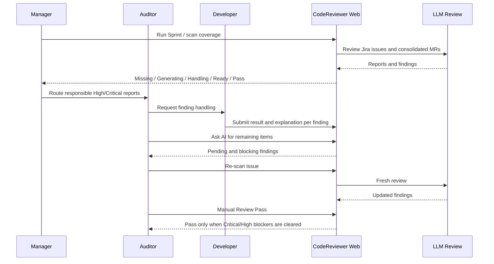
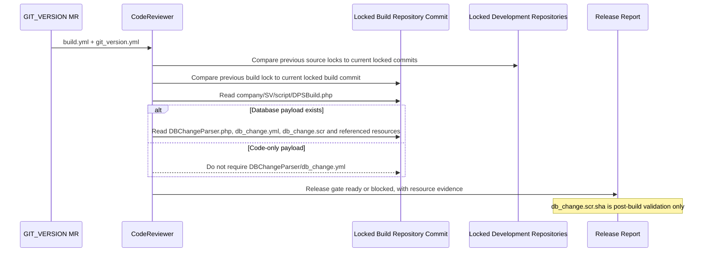
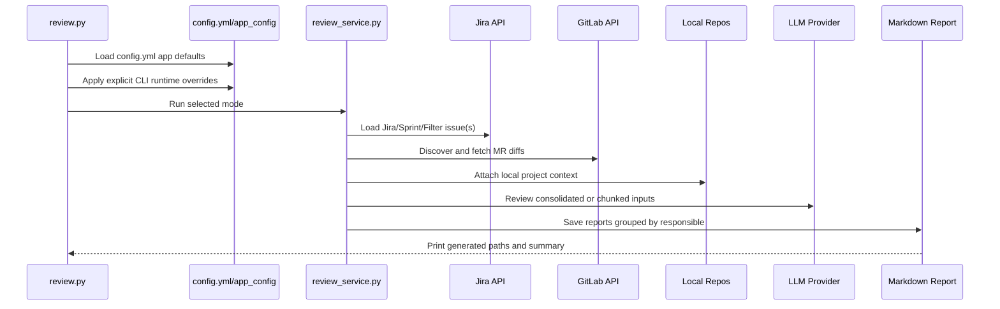
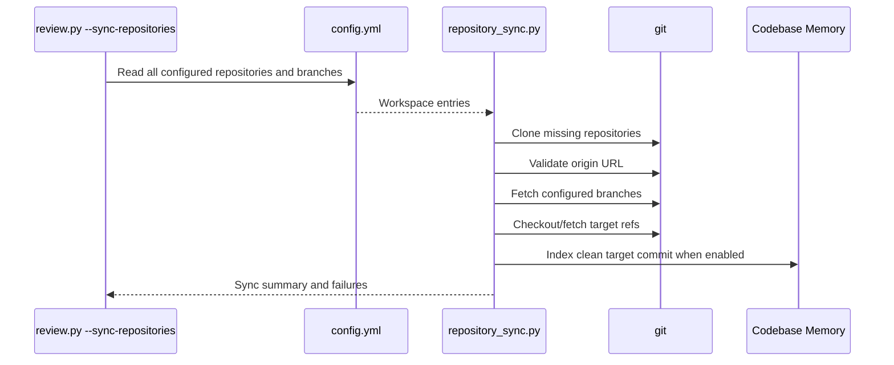

# CodeReviewer Code Review Flow

## Role Workflow

| Role | Primary workflow |
| --- | --- |
| Manager | Run Sprint/Jira Filter review, scan all report coverage, route High/Critical reports to responsible Auditors, verify handling completion, trigger re-scan, and record release Review Pass. |
| Auditor | Review one Jira issue for owned responsible projects, inspect and discuss findings, ask AI for pending items, collect Developer handling, re-scan, and record Review Pass when blocking items are cleared. |
| Developer | Read assigned reports, inspect file Diff and remediation guidance, and submit `fixed`, `follow-up`, or `not-issue` plus an explanation for each finding. |



本文说明当前 `config.yml` 的使用方式，以及一次 Code Review 从 Web/CLI 输入到 Jira/MR 发现、Diff 拉取、本地代码上下文、LLM 审核、报告生成和 Web 展示的完整调用关系。

## 1. 配置边界

默认配置文件：

```text
D:\TTL\vibe-coding\CodeReviewer\config.yml
```

生产部署时建议对应到：

```text
/opt/codereviewer/current/config.yml
```

配置职责：

| 配置来源 | 职责 |
| --- | --- |
| `config.yml` | 项目清单、仓库 URL、版本分支、本地 working copy、responsible、project_name、llm_model、Review 策略、报告策略、Jira/MR 发现策略、LLM 默认策略、本地上下文策略 |
| `.env` | GitLab/Jira token、服务 URL、Web host/port、IP 白名单、部署路径、Teams webhook、Codex/cc-switch/Codebase Memory 二进制位置 |
| CLI 参数 | 单次运行范围和 runtime override，例如本次只跑某个 Jira、Sprint、Filter、MR，或临时改报告优先级 |
| Web 表单 | 当前登录用户触发的 Review Job 输入，例如 Jira key、Sprint、Jira Filter ID、Report Priority |

配置优先级：

```text
runtime override > config.yml app: > .env / environment > code default
```

其中 runtime override 来自 CLI 显式参数或 Web 表单，例如 `--report-min-severity High`、Web 中选择 `High and above`。

## 2. config.yml 使用方式

### 2.1 顶层 app 配置

`config.yml` 顶层 `app:` 是应用策略默认值，例如：

```yaml
app:
  report:
    language: zh-CN
    min_severity: Medium
    history_days: 14
    group_by_responsible: true
  review:
    mr_states: [opened, merged]
    jira_allowed_statuses: [Development Done]
    release_gate:
      deferred_roles: [company_config, scr]
      branch_prefixes:
        company_config: [COMPANY_CONFIG, DPS11_CONFIG, DPS9_CONFIG, WVADMIN_CONFIG]
        scr: [SCR, DPS11_SCR, DPS9_SCR]
        git_version: [GIT_VERSION, DPS11_GIT_VERSION, DPS9_GIT_VERSION]
    chunk_auto: true
  llm:
    provider: auto
    codex_model: gpt-5.6-sol
    cc_switch_provider: Claude code opus
    reasoning_effort: high
    speed: standard
    codex_timeout_seconds: 300
    max_retries: 3
  local_context:
    auto: true
    repository_sync_required: true
    codebase_memory_enabled: true
```

主要作用：

| app 配置段 | 用途 |
| --- | --- |
| `report` | 默认输出语言、最小报告优先级、按 responsible 分目录、历史记录默认时间范围 |
| `review` | MR state、Jira 状态、忽略分支类型、chunk 分片、GitLab/Jira discovery 开关 |
| `jira` | Jira project key、Sprint/Filter 最大 issue 数 |
| `jira_prd` | 本地 Jira/PRD 文档路径、缺失时自动抓取、fetch depth |
| `llm` | Provider、model、timeout、retry、reasoning、speed、context/prompt budget |
| `local_context` | 是否自动匹配本地仓库、是否强制同步、上下文预算、workspace roots |
| `git_tools` | 需要扫描的 config group、MR 是否必须匹配项目清单 |
| `git_version` | GIT_VERSION 深度 Review 的代码仓库和构建资源检查策略 |

### 2.2 项目配置

项目清单仍按业务组组织，例如：

```yaml
dps11-repository:
  ttl_access_control:
    repository_url: https://gitlab.tx-tech.com/wvp-sv/dps11/micromod/mod_acl.git
    branch: 11.2.83
    local_working_copy: D:/TTL/vibe-coding/git-tools/git-repos/dps11-repository/ttl_access_control
    responsible: kevin.tan
    project_name: dps11#acl
    llm_model: gpt-5.5
    dev_branch:
      - DPS11
```

关键字段：

| 字段 | 用途 |
| --- | --- |
| `repository_url` | 匹配 GitLab project path，也用于 clone/fetch |
| `branch` / `branches` | 需要同步和读取的版本分支 |
| `local_working_copy` | 本地完整代码仓库，用于广角 Review |
| `responsible` | Web 授权、报告目录分组、Teams @ 对象 |
| `project_name` | 报告命名、Web 项目展示 |
| `llm_model` | 项目级 LLM model，优先于全局默认 |
| `dev_branch` | 开发版本分支，Sprint/Jira/Filter 汇总 Review 默认不纳入 |

## 3. Code Review 主流程

### 3.1 入口

支持入口：

```powershell
python review.py --jira ECHNL-8888
python review.py --sprint 10068
python review.py --jira-filter 12345
python review.py --mr-url "https://gitlab.tx-tech.com/group/project/-/merge_requests/123"
python review.py --sync-repositories
```

Web 入口：

| API | 用途 |
| --- | --- |
| `GET /api/report-check` | 单个 Jira Review 前检查现有报告和 MR 指纹，判断是否可复用 |
| `POST /api/reviews` | 创建 Review Job |
| `GET /api/reviews` | 获取当前和历史 Job |
| `GET /api/reviews/{job_id}` | 获取单个 Job 进度 |
| `POST /api/reviews/{job_id}/pause` | 暂停 |
| `POST /api/reviews/{job_id}/resume` | 恢复 |
| `POST /api/reviews/{job_id}/stop` | 终止 |
| `POST /api/reviews/{job_id}/retry` | 重试或 Re-scan |

### 3.2 Jira issue 加载

1. 单个 Jira：读取指定 issue。
2. Sprint：按 `app.jira.project_key` 和 Sprint ID 查询 issue。
3. Jira Filter：按 Filter ID 查询 issue。
4. 默认只 Review `app.review.jira_allowed_statuses` 中的状态，例如 `Development Done`。
5. 如果本地缺少 `ECHNL` 或 `SVREQ` 文档，且 `app.jira_prd.auto_fetch=true`，会调用 `D:\TTL\jira-prd\fetch_jira.py --depth 2` 抓取上下文。

### 3.3 MR 发现

MR 来源按优先级合并去重：

1. Jira issue description / comment 中的 GitLab MR URL。
2. Jira remote links。
3. Jira development panel。
4. GitLab 搜索 issue key。
5. 按 `config.yml` 项目清单进行 branch discovery。

发现后过滤：

| 过滤项 | 当前规则 |
| --- | --- |
| 项目白名单 | MR project 必须能匹配 `config.yml` 的 `repository_url`，除非配置放宽 |
| MR state | 默认包含 `opened` 和 `merged` |
| dev branch | target branch 命中 `dev_branch` 时默认跳过 |
| ignored branch type | source branch 前缀命中 `Company_Config` 或 `Git_Version` 时跳过，不区分大小写 |
| 重复 MR | 按 MR URL 去重 |

### 3.4 Diff 拉取

每条 MR 会拉取：

1. MR 详情：source branch、target branch、state、commit、project。
2. MR changes：优先 `/changes`。
3. 如果 `/changes` 返回空或结构异常，fallback 到 `/diffs`。
4. Diff 统一转换为 `ReviewInput.changed_files`。

如果部分 MR 拉取失败：

- Job progress 显示失败 MR。
- 其余 MR 可以继续 Review。
- 如果所有 MR diff 都失败，则该 Jira Review 失败并显示原因。

### 3.5 本地代码上下文

Review 不只看 MR diff，也会结合本地完整仓库：

1. 根据 MR project path 匹配 `config.yml` 中的 `local_working_copy`。
2. 对应仓库执行 fetch / checkout target ref。
3. 如果配置要求同步而本地仓库异常，会在 progress 中明确报错。
4. 读取项目结构、相关文件、调用关系、Codebase Memory 上下文。
5. 对 DPS/Drupal 项目，结合 Drupal skill 和 DPS 规则 Review。

Codebase Memory 目标：

- 维护项目长期知识库。
- 降低每次 Review 都全量扫描项目的成本。
- 帮助发现跨文件、跨模块、跨历史上下文影响。

### 3.6 Context 预检与分片

在调用 LLM 前会估算 prompt/context 大小：

1. Web progress 显示 `LLM context current/budget chars`。
2. 超过阈值时裁剪低优先级上下文。
3. 大 issue 支持按 MR/project/responsible 分 chunk。
4. chunk Review 完成后再生成汇总报告。
5. 如果仍超过硬上限，会失败并提示超限来源。

### 3.7 LLM Review

Provider 选择：

1. 优先按项目 `llm_model`。
2. 再使用 `app.llm` 全局策略。
3. DPS 项目默认要求 `codex-cli`。
4. Codex 失败、reasoning/speed 降级或结构化输出不合格时，按配置重试或失败。

默认策略：

| 项 | 默认 |
| --- | --- |
| Model | `gpt-5.5` |
| Reasoning | `high` |
| Speed | `standard` |
| Timeout | 300 秒 |
| Retry | 3 次 |
| Output | strict JSON |

### 3.8 报告生成

报告输出：

```text
D:\TTL\code-review\e-channel-sprintYYYYMMDD\<responsible>\ECHNL-xxxx_has-issue-high.md
```

规则：

1. CLI/batch 默认按 responsible 分目录。
2. 同一 Jira 涉及多个 responsible 时，CLI/batch 按 responsible 拆分报告内容。
3. Web 单个 Jira Review 以当前登录用户目录隔离报告，避免不同登录用户互相覆盖；文件名不再重复 owner 前缀。
4. 合并 Review 仍然只对同一 Jira 的相关 MR 做一次整体评估；落盘报告时再按 responsible 或 Web 登录用户规则保存。
5. `kevin.tan+wen.yi` 这类多 owner responsible 值在 CLI/batch responsible-split 下会展开成 `kevin.tan` 与 `wen.yi` 两份报告，不再生成 `kevin.tan+wen.yi` 合并 owner 报告目录。
6. Web 单个 Jira Review 前会调用 `/api/report-check`，读取当前输出目录/历史目录中同一 Jira 的报告，并用报告内隐藏 MR 指纹与当前 Jira/GitLab MR 元数据对比。
7. 同一登录用户已有 fresh 报告且 MR commit/state/source/target 未变化时，Web 提供 `Use Existing`，跳过新的 LLM Review。
8. 其他登录用户已有 fresh 报告时，只作为提示展示，不跨用户静默复用；用户需要自己的隔离副本时可显式 Re-scan。
9. MR 元数据已变化或无法确认 freshness 时，同一登录用户重复 Review 同一 issue 需要双重确认。
10. Re-scan 会保留旧报告，并支持 Compare 展示新增/减少问题。
11. 报告优先级默认只展示 Medium 及以上，可通过 Web/CLI runtime override 调整。

报告核心段落：

1. 基本信息
2. 审核结论
3. 变更摘要
4. 关联 MR
5. 文件 Diff
6. 问题列表
7. 处理模版
8. 测试建议
9. 其他

## 4. Web 展示与沟通

Web 功能：

| 功能 | 说明 |
| --- | --- |
| 登录 | 用户名为 responsible，密码为强随机密码，支持 IP 白名单 |
| Projects | 按登录用户显示其负责项目；admin/root 可看全部 |
| Run Review | 支持 Jira、Sprint、Jira Filter；Sprint/Filter 仅 admin/root 可用 |
| Progress | Job/polling 模式，刷新浏览器后可回显进度 |
| Report Preview | 支持 Markdown 在线预览、Tab 制式、Raw、Download、Maximize、Previous/Next |
| Report History | 支持搜索、最近 2 周过滤、Responsible Downloads/Markdown Reports Tab |
| Review Communication | 支持处理说明、AI Chat、Teams 发送准备、状态查看、Re-scan、Manual Pass |

## 5. 调用时序图

### 5.1 Web Review

```mermaid
sequenceDiagram
    participant User as User
    participant Web as Web UI
    participant API as web_app.py
    participant Service as review_service.py
    participant Config as config.yml/app_config
    participant Jira as Jira API
    participant GitLab as GitLab API
    participant Repo as Local Repos
    participant Memory as Codebase Memory
    participant LLM as Codex/cc-switch
    participant Report as report.py

    User->>Web: Input Jira/Sprint/Filter and click Run Review
    alt Single Jira review
        Web->>API: GET /api/report-check
        API->>Jira: Load issue metadata for current MR discovery
        API->>GitLab: Fetch MR metadata fingerprint without diff/LLM
        API-->>Web: reusable / changed / unknown report status
        Web-->>User: Use Existing or Re-scan confirmation
    end
    Web->>API: POST /api/reviews
    API->>Config: Load app policy and project list
    API->>Service: Create background Review Job
    Web->>API: Poll GET /api/reviews/{job_id}
    Service->>Jira: Load issue(s)
    Service->>GitLab: Discover related MRs
    Service->>Config: Match MR project, responsible, branch, llm_model
    alt Company Config or DPS SCR branch
        Service->>GitLab: Fetch lightweight MR metadata only
        Service-->>Report: Record as deferred to GIT_VERSION gate
    else GIT_VERSION branch in Jira/Sprint/Filter
        Service-->>Web: Record explicit MR-mode requirement; do not consolidate
    else Normal source branch
        Service->>GitLab: Fetch MR detail and diff
    end
    Service->>Repo: Resolve local_working_copy and sync target ref
    Repo->>Memory: Build/reuse codebase memory context
    Service->>Service: Build prompt, preflight context size, chunk if needed
    Service->>LLM: Review diff and context
    LLM-->>Service: Strict JSON findings
    Service->>Report: Render responsible-specific Markdown reports
    Report-->>Service: Report paths
    Service-->>API: Persist progress and final result
    Web->>API: Refresh reports / preview / download / discuss
```

For a GIT_VERSION release gate, the Auditor/Manager starts one explicit MR review. That MR path then follows the locked-source/build sequence in section 5.4.

### 5.4 DPS GIT_VERSION Release Gate



### 5.2 CLI Review



### 5.3 Repository Sync



## 6. 关键失败点与处理

| 失败点 | 表现 | 处理 |
| --- | --- | --- |
| Jira API 失败 | Sprint/Filter 无法读取 issue | 检查 Jira token、URL、API 版本 |
| MR discovery 缺失 | 发现 0 MR | 检查 Jira activity、branch 命名、config 项目清单、MR state |
| MR diff 拉取失败 | progress 中显示 fetch failed | 检查 GitLab token、MR 权限、fallback `/diffs` |
| 本地仓库异常 | Codebase Memory / checkout 失败 | 运行 `python review.py --sync-repositories` |
| Context 过大 | chunk-start 或 context 超限 | 降低上下文预算、拆分 MR、裁剪低优先级上下文 |
| Codex 超时 | LLM provider failed after retries | 调整 chunk、timeout、speed，或减少上下文 |
| 报告缺失 | Preview 报 Report not found | Refresh Reports，必要时 Regenerate |

## 7. 生产建议

1. 发布前固定 `config.yml app:`，不要把策略散落在 `.env`。
2. `.env` 只放密钥、URL、端口、路径、二进制位置。
3. 每次发布后验证 `/api/version`。
4. 定时运行 `--sync-repositories`，保证本地 working copy 和 Codebase Memory 新鲜。
5. 对大 Sprint 建议分批 Review，避免多个超大 issue 同时占满 LLM 和 Git 操作资源。
