### 2026-07-06 feedback
1、扫描Jira issue相关的MRs时，过滤和project key相同的同名分支（统一转换为大写）；(DONE)
- ITRADE_CLIENT_7.5.0
- ITRADE_CLIENT_7.5.1
2、issue description 放不下全部的内容，需要补充在issue comment；
3、数据库的调整：不是使用drupal hook_update机制，而是使用构建代码仓库的db_change.scr机制；（DONE）
4、需要确认是否排除 DPS11_Config-1.4.72(11.2.83.1)、GIT_VERSION ，SCR（如：DPS11_SCR-1.4.72(11.2.83.1)）分支类型？（DONE）
5、Code Review Report：关联MR段落，新增列：状态，是否Closed或Open或其他；（DONE）
6、基于issue description 补充（或英文：Additional remarks）列出的“涉及的文件列表”（英文：Involved File Lists），验证实际修改的文件列表，如果不匹配，则在“问题列表”反馈为[Warning]警告issue，需要澄清或补充issue description，以确保一致；（DONE）

基于config.yml配置的代码仓库信息：D:\TTL\vibe-coding\CodeReviewer\config.yml，每次总是拉取最新的分支代码到本地 D:\TTL\vibe-coding\git-tools\git-repos； 
基于config.yml添加key：local_working_copy，指向git-tools\git-repos对应的目录；
1、并基于config.yml配置的itrade-client、services-terminal下面的 gitlab-projects > branch读取需要拉取的分支代码；
2、基于config.yml配置的middle-office下面的wvamin-projects > branch，dps9-projects > branch，dps11-projects > branch读取需要拉取的分支代码；

举例：
D:\TTL\vibe-coding\git-tools\git-repos\itrade-client\itrade-client  <-> https://gitlab.tx-tech.com/itrade-sv/client/web.git （包括 itrade-client-7.5.0，itrade-client-7.5.1）
D:\TTL\vibe-coding\git-tools\git-repos\itrade-client\services-terminal <-> https://gitlab.tx-tech.com/itrade-sv/terminal/web.git
D:\TTL\vibe-coding\git-tools\git-repos\build-repository\itrade-client <-> https://gitlab.tx-tech.com/web-sv-build/webfe/itrade-client.git（包括 itrade-client-7.5.0，itrade-client-7.5.1）
D:\TTL\vibe-coding\git-tools\git-repos\build-repository\services-terminal <-> https://gitlab.tx-tech.com/web-sv-build/webfe/services-terminal.git
D:\TTL\vibe-coding\git-tools\git-repos\build-repository\dps <-> https://gitlab.tx-tech.com/web-sv-build/dps.git （包括 dps9-projects，dps11-projects）
D:\TTL\vibe-coding\git-tools\git-repos\build-repository\wvadmin  <-> https://gitlab.tx-tech.com/web-sv-build/webfe/wvadmin.git

每个gitlab仓库都有一个本地working copy对应；

共享 GPT 额度号池：[router-for-me/CLIProxyAPI](https://github.com/router-for-me/CLIProxyAPI)
请帮我安装CLIProxyAPI工具，把codex登录的账户，接入工具，并让CodeReviewer接入GP额度账户池；

在实际应用场景中，一般有3类人员使用CodeReviewer
1、Auditor：审核团队成员提交的代码、配置文件；一般是小组Leader，可以Review issue（单个issues），并在线预览报告，和AI聊天了解报告反馈的问题，可给出处理结果，询问AI还有哪些issue为处理；如果issues都整改好了，可以手动操作Pass通过；
2、Developer：查看代码审核报告中的问题列表，查看问题清单及修复意见，做出处理，并按照处理模版，给出每个问题的处理结果；
3、Manager：在合并构建代码仓库发起的Company_Config/GIT_VERSION/SCR类型的分支时，先Review整个Sprint的issues，并扫描报告，是否包括High及以上级别的issues，如有发给Auditor跟进；确保所有的issues报告的问题，都已经给出处理结果，对于需要在发版本前修复的issues，必须完成整改，并re-scan sprint issues；
4、Auditor、Manager：支持扫描还没有生成Review报告的issues，可以统计哪些issues还在生成报告，哪些issues，已经生成报告文档；哪些issues已经Review Pass通过，哪些issues还有问题清单在处理；注：Auditor是以responsible作为判断依据的；

三者分工明确：GitLab 只负责提供 MR 元数据与 commit SHA，本地 working copy 负责生成精确 diff，Codebase Memory/GitNexus 只查询受影响关系，不再为每条 MR 重复 checkout 或扫描全仓库。我先梳理当前 diff 获取与索引调用链，再把可复用的本地 commit/diff 缓存接入实际 review 流程。

另见:6.14.0-实质性优化.jpg
GitNexus 实际上只保存报告和 metadata，并没有参与代码关系查询；本次已经把它升级为不可变 changes 缓存。代码关系图仍由 Codebase Memory 负责，两者现在各司其职。

1、尝试整合create automatically ECHNL issue based on SVREQ issue（支持--dry-run模式），以及Review issue description的功能设计，并给出非常有针对性、非常中肯的反馈意见（结合codebase-memory-mcp、gitnexus充分分析代码，预描代码，给出具体的代码设计，可落地，可运行）。
2、整合ECHNL issue audit check rules，self-check issues automatically created by JiraReviweer；
3、参考CPA（CLIProxyAPI）AI网关代理，实现整体的页面框架设计及功能编排；
4、技术架构： Flutter(Dart language) 

2026-07-12
1、合并issue description及comment中包含issue description模版的comments，作为完整的、最终版本的“issue description”；
2、issue description模版如下：
2.1、一定包括table，三列（中文）：截图，说明，补充；如果是英文：Screenshot，Description，Additional remarks；
2.2、其中第二列：
- 非缺陷类：需求描述 ，英文：Requirement Description  or 缺陷类：问题描述 ，英文：  Bug Description
- 非缺陷类：需求分析 ，英文：Requirement Analysis or 缺陷类：问题分析 ，英文：Bug Analysis
- 非缺陷类：解决方案 ，英文：Proposed Solution or 缺陷类：解决方法  ，英文：Workaround
- 非缺陷类：预期结果 ，英文：Expected Result
2.3、其中第三列：
- 受影响的项目或功能范围 ，英文：Affected Project or Functional Scope
- 涉及的文件清单，英文：Involved File Lists

支持设置job schedule排程，以便错峰使用LLM Token；

Claude Code、Cursor、Cline只认Authropic格式；NVIDIA、通义千问、Ollama、第三方中转只认OpenAI兼容格式；
CLIProxyAPI做双向翻译：客户端请求 -> 转对应上游格式转发，上游返回 ->转回客户端识别格式；
额外能力：
1、多账号负载均衡、轮询、配额耗尽自动切换备用key；
2、统一入口：所有AI客户端只填http://127.0.0.1:8317/v1 一个地址；
3、支持Gemini oAuth登录、Claude网页授权、OpenAI key、本地Ollama；
4、自带Web管理面板，可视化查看调用量、延迟、报错日志；

开发计划；
1、10.0 多angent处理： 一个Agent Sprint Review（使用 GPT 5.6），一个Agent Fix issues（使用Claude Code），一个Agent做最后的GIT_VERSION MR check；
2、7.x：新增Review History审核历史功能，可以查看每个issues的Review进度；

菜单设计：
左边功能导航菜单：
1、Code Review
2、Code Review History
3、Jira Integrated
- Create Jira issue
- Review issue
4、Settings：包括 environment config ， application-specific config；

明确工作流：

基于SVREQ issue自动创建ECHNL issue -> Jira Reviewer审核 -> 开发 -> Development Done -> Code Reviewer ->  Feedback & Fix -> Ticket issued and auto-create issue by AI  -> Manual Pass -> Generate review history record

#### 2026-07-17 feedback for 7.1.2
- 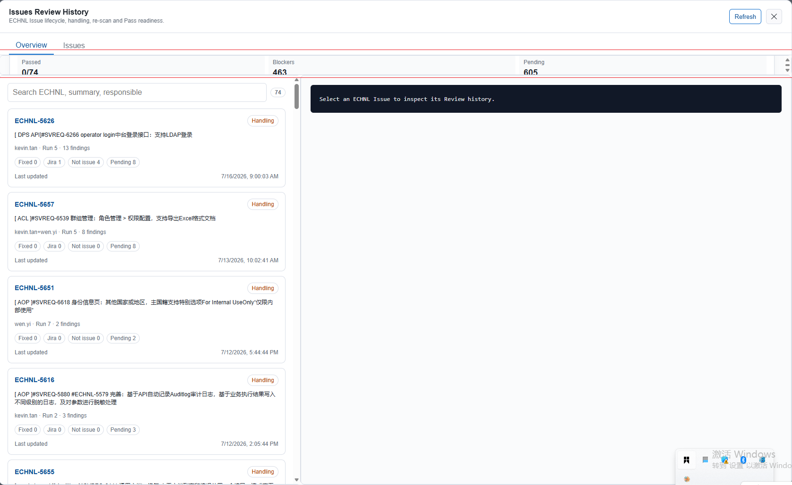
- CodeReviewer Release Notes 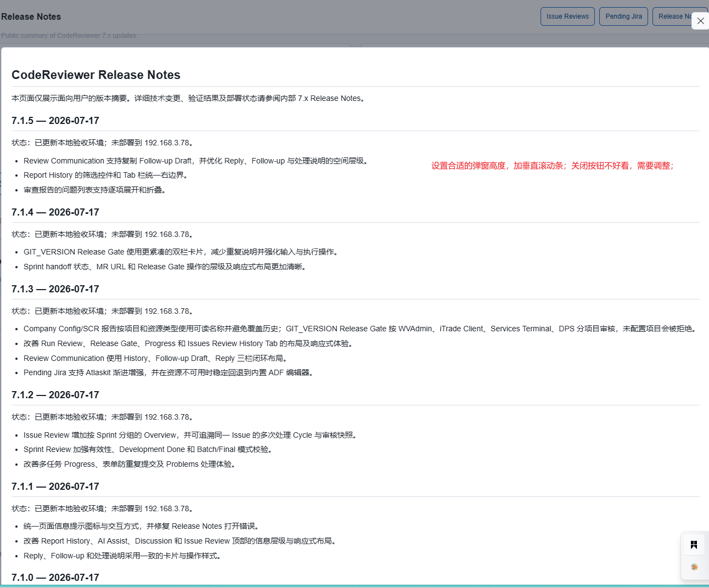
- Review Conmmunication
    - Copy：修改为 常用的copy icon，有触感的氛围设计；
    - 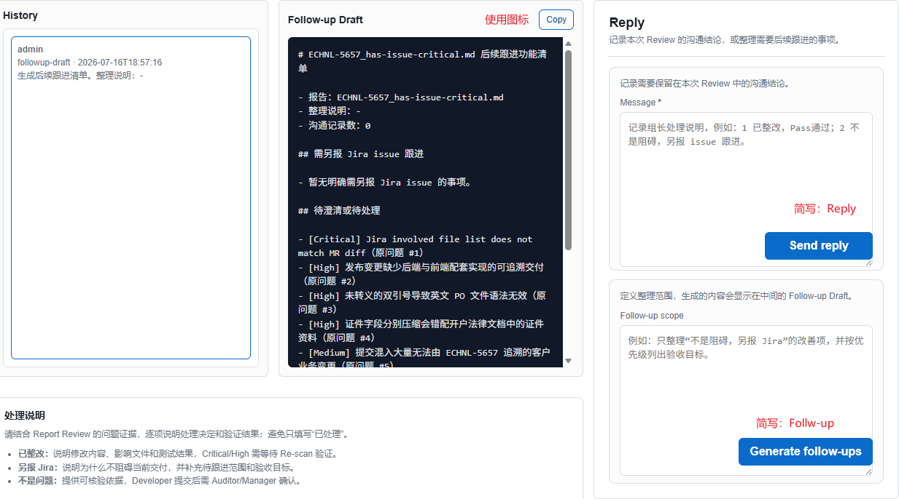
    - Reply：拖动textarea右下角，向下拉时，按钮浮在上面；
    - 处理说明：移除区块，History+Follow-up Draft往下拉伸；在Reply页面，标题栏放一个information icon，点击可以查看完整的内容；
    - Review Issue History：右边面板，卡片区域布局优化；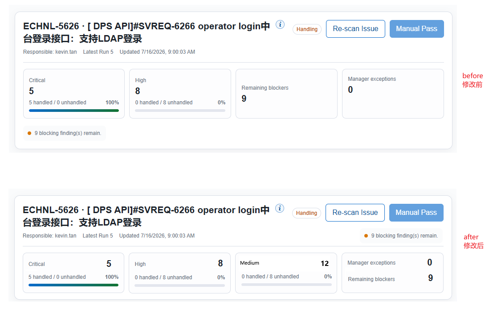

#### 2026-07-17 feedback for 7.2.0
- Run Review: GIT_VERSION MR URL输入框，支持换行（最多2行）；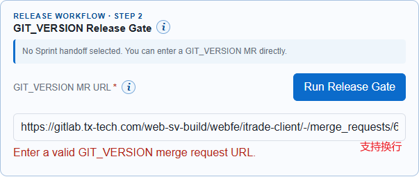
- Sprint Review： messy layout；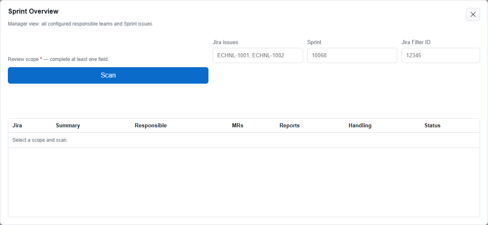
- Run release gate：invalid MR URL ；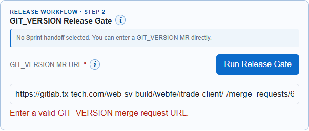 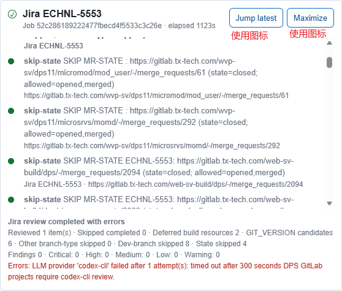

#### 2026-07-18 feedback for 7.2.5
- Sprint Review: 当从openai连接不了 到 链接恢复时，状态一直卡住 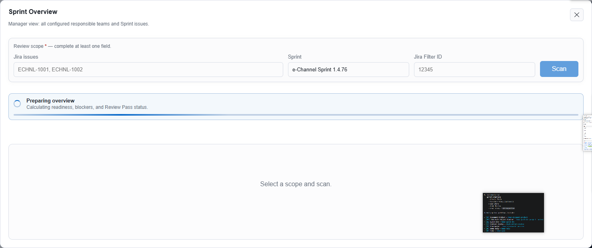
- Sprint Review: No report 13 : means No. of report(3) is 13 ? 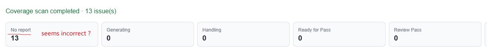
- Sprint Review：卡片部分，把issue状态如 “Development Done”放在 Run Review按钮下面；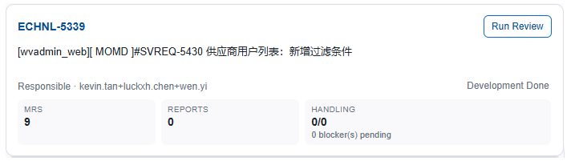
- Sprint Review：点击“Run Review”，关闭弹窗，进入主页的Run Review > Progress面板；可以改善一下，不离开当前弹窗页吗？这样的交互体验会好很多；
- Run Review：当手动拖动正在处理的issue 垂直滚动条时，或点击滚动条的上下边际时，理应不会再跳动；当用户不再操作的60秒后，又恢复自动滚动到最新的消息；

#### 2026-07-18 feedback for 7.2.8
7.2.8问题反馈：基于你作为专业前端开发工程师、资深设计师的审美、设计造诣，结合自洽性，完善 web 功能设计；
- 支持在线维护Gitlab项目，参考CLIProxyAPI（CPA)，从config.yml读取gitlab项目：DPS（DPS9、DPS11）、iTrade（7.5.0,7.5.1）、Services Terminal、WVAdmin，及其子节点配置信息；并支持在线维护；
- 支持在线维护应用配置，参考CLIProxyAPI（CPA)，从config.yml读取配置节点；并支持在线维护；
- 在登录页、主页：新增Healthy status indicator，使用氛围设计，可点击进入详情页查看；
- User Management: 左边列表页面，messy layout.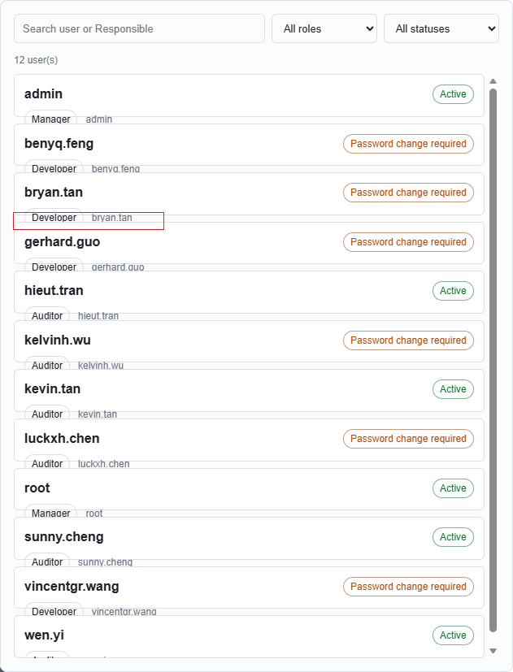
- User Management：右边面板，Responsible mappins的设计是否符合预期，并补充一下如何使用？更新到User Mannual手册；
- CodeReviewer Release Notes：显示最后更新时间 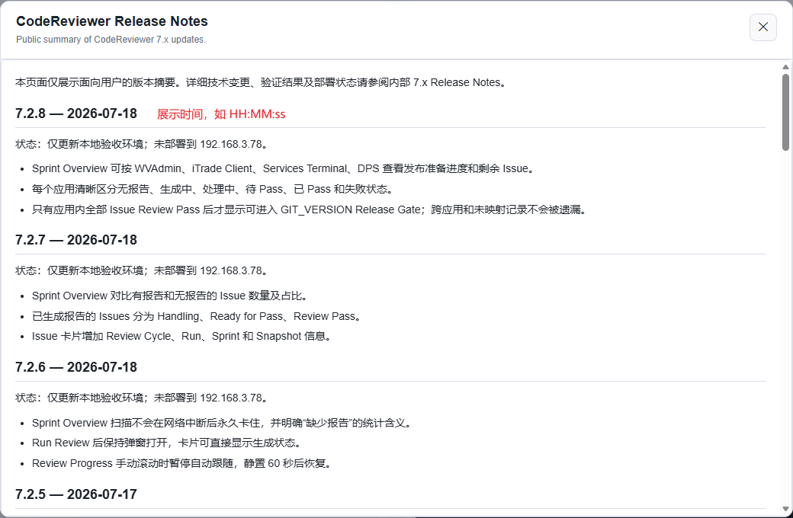
- Change Password:必填、必须字段，使用红*表示，并放在字段的后面（保持一定间隔）；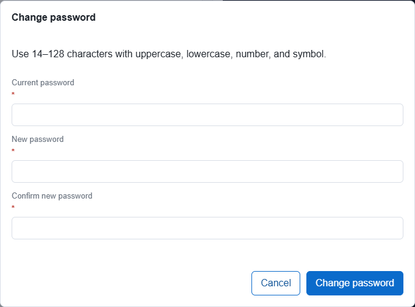
- Review Communication > Reply：调整布局的合理性，满足合理、自洽性； 
- Report Review：调整字体大小，间距；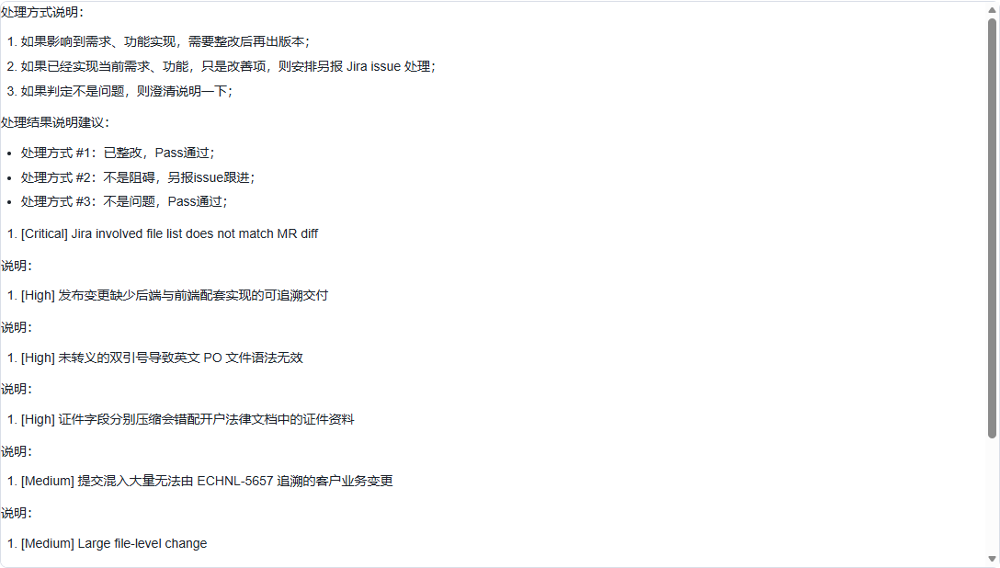
- 参考Sprint Review最新的实现：按 WVAdmin、iTrade Client、Services Terminal、DPS 分别展示 Release Readiness；进度计算：Review Pass Issue 数 ÷ 应用关联 Issue 总数。例如 5 个 Issue 中 4 个已 Pass，显示 80%，剩余 1 个；每个应用展示：Reports / Without report，Generating，Handling，Ready for Pass，Review Pass，Failed，Remaining Issues 
- 另见：D:\TTL\vibe-coding\CodeReviewer\devplan\feedback for 7.2.8.md

#### 2026-07-19 feedback for 7.2.9
- Sprint Review:Coverage scan timed out after 60 seconds. Network access may have been interrupted; reconnect and Scan again. 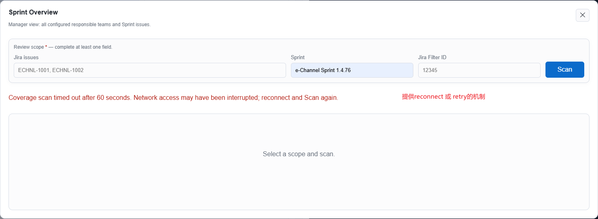

#### 2026-07-19 feedback for 7.2.10
请基于“feedback for 7.2.10.md” 有关v7.2.10的反馈问题列表，基于你作为专业前端开发工程师、资深设计师的审美、设计造诣，结合自洽性，完善 web 功能设计；
请启用多Agent完成；

另见： D:\TTL\vibe-coding\CodeReviewer\devplan\feedback for 7.2.10.md

#### 2026-07-19 feedback for 7.2.11
请基于“feedback for 7.2.11.md” 有关v7.2.11的反馈问题列表，基于你作为专业前端开发工程师、资深设计师的审美、设计造诣，结合自洽性，完善 web 功能设计；

另见：D:\TTL\vibe-coding\CodeReviewer\devplan\feedback for 7.2.11.md

#### 2026-07-19 feedback for 7.2.13
请基于“feedback for 7.2.13.md” 有关v7.2.13的反馈问题列表，基于你作为专业前端开发工程师、资深设计师的审美、设计造诣，结合自洽性，完善 web 功能设计；

另见：D:\TTL\vibe-coding\CodeReviewer\devplan\feedback for 7.2.13.md

#### 2026-07-22 feedback for 7.2.14
请基于“feedback for 7.2.14.md” 有关v7.2.14的反馈问题列表，基于你作为专业前端开发工程师、资深设计师的审美、设计造诣，结合自洽性，完善 web 功能设计；

D:\TTL\vibe-coding\CodeReviewer\devplan\feedback for 7.2.14.md